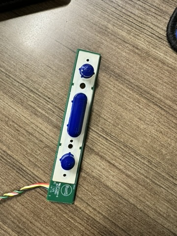

# Component Overview

The internals are relatively simple consisting of power, input, and output. It looks far more complex than it is.

## Internal Overview

The two beige PCBs are power supplies. The larger one is the main supply for all of the components in the unit. The larger supply feeds the smaller supply via a 14-pin single stack connector. The smaller supply is dedicated to the backlight of the display panel.

## Rapt Controller, Interposer, and Sensor Boards

The Jamboard is using a Rapt Optical Touch system. Along each edge, of the back, there is a small PCB connected to three shielded ribbon cables. The inner cables are connected to the lowest visible PCB (the interposer). The outer cables are routed out to the edges of the glass. Along the inside edge of the glass are a series of optical sensors connected via these cables to the 4x small boards around unit. The interposer PCB is connected to the PCB just to the right that is covered by the aluminum heat sink, the main controller. These 6 PCBs are the Rapt optical touch solution. They are enabling the touchscreen and pen functionality on the display. I believe the board under the heat sink is the main processor, while the board to the left is just the interposer for the 4 boards along the perimeter. The interposer is connected to the controller via a 4-pin cable for data (it appears to be USB) and a power cable. The main controller is connected to the carrier board with the via a power connection and a similar USB data cable that is also broken out into another connector with more wires. I'm not certain what this is but it could be power signaling based on other observations around the unit.

## Carrier Board

The large board in the middle right is the main control unit for the whole display. Fundamentally, this is a large carrier board for a standalone nVidia Jetson SoC module. The Jetson module can be see as the aluminum rectange in the upper left of the carrier. Prior to removal by me, the factory installed TX1 had a large heatsink installed. There was copious thermal compound between the SoC and a full cover aluminum plate. Two 8mm heat pipes are connecting the plate to the large heat sink. There are lots of connections to and from this board along with some unused connections both visible and hidden under the shield. There are two small momentary switches on the board as well. One of these is system reset button. I'm not sure what is under the large heat sink as it's pinned and soldered to the carrier. It's not currently worth the trouble to remove it. My best guess is that it's a supplimental video scaler/processor. Several of the traces from the IC are routed to the HDMI inputs in the lower right corner. The Jamboard allows for 2 HDMI inputs; one each from the side and rear IO. This IC is likely for processing those inputs to the LCD panel. There are also traces going directly over to the eDP port which connects to the LCD panel. It appears as though the Jetson module is sending it's video through this processor since it doesn't appear that the Samtec header is directly connected to the eDP port at the bottom of the board. The photos are shown with the shield removed. Normally hidden under the shield is an additional HDMI port that is not accessible with the shield installed. My current guess is that this is a direct HDMI output from the Jetson. It is directly connected to both the Jetson connector and the video processor IC. Next to this HDMI, and also generally hidden under the shield, is a 6-pin JST with an unknown purpose. The traces are routed over to the Jetson header. I'm hopeful that this is a UART connection. The traces are routed through some very small 8-pin chips with s02 (I think) etched on them. They're label with "U" but that just indicates it as an IC if Google is following PCB labeling standards. I'll need to trace them out with a meter and see what they're connected to on the header, if they pass continuity through. Going through the ICs they might not be electrically connected with no power to the board.  There are 2x exposed white 4-pin headers that are also unused with an unknown purpose at this time. Based on the traces it looks like they are both connected to the video processor IC. Possibly JTAG and/or UART for it. 

Extended details of the carrier board are a work in progress and are documented [here](carrier.md)

## Side I/O

The board on the right is for IO. It's taking in data from the USB type-c and type-a ports as well as video in from the USB type-c and the HDMI port. It's also able to send touch input data to a connected device via the USB type-c port. This allows the screen to act as a large touchscreen display for a connected computer. There are several premade patch cables connecting this board to the carrier board along with one exception. The topmost connector is of the same type as the unknown connection on the touch screen interposer. I want to assume it's power since the board has no other connections that could be fulfilling that purpose. Next is a USB 3.0 Type-A cable. This cable is a USB 3.0 Type-A to Type-C cable that runs up to the camera at the top of the unit. Under that is a USB 3.0 micro-b cable. Next is a Displayport cable and lastly, at the bottom, is an HDMI cable. Externally, it has one HDMI input, two USB 3.0 type-A ports, and one USB type-C port.

## Rear I/O

In the bottom middle is an additional IO interface. It's visible through all 3 rear panel covers. It's similar to the side IO board but it contains the main IEC power input connection, gigabit ethernet, a TOSLINK optical audio output, an additional HDMI input, and a micro-b USB port. The ethernet, USB, HDMI ports are connected directly back to the carrier with off the shelf patch cables. The TOSLINK port is locally converted to audio and fed into the carrier along with other connections via an 8-pin connector between the carrier and the IO pcb. This USB port is connected directly to the carrier board and serves as the recovery port connected directly to the Jetson module.

## Button Panel

The last PCB is small and for the button panel. There are 4 buttons. Power, Volume Up, Volume Down, and Input. Although, I believe the Vol buttons function as display brightness when using the external HDMI inputs. Not sure why that's the case. More testing is needed. The most relevant detail here is that the "VOL Up" button doubles as the force recovery button. Using continuity on a multimeter, I traced this button all the way back to pin E1 on the 400-pin Samtec header for the Jetson module.

