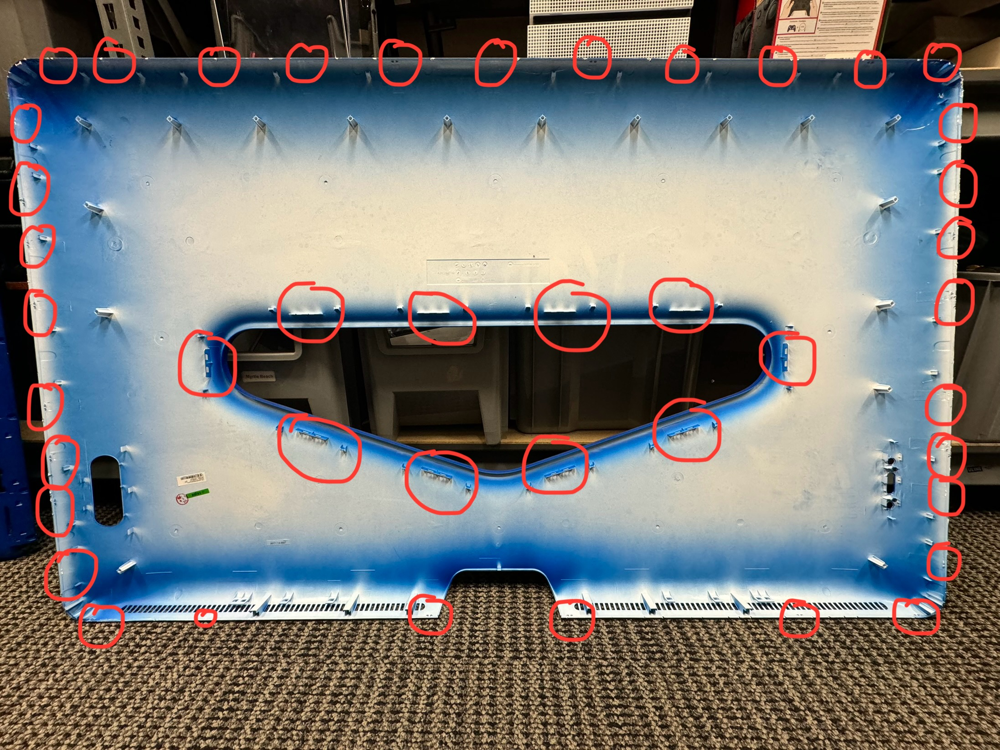

# Disassembly

The Jamboard is a fairly difficult device to gain access to. The back panel consist 3 pieces of plastic. There's a small deco cover, a large deco cover, and a large inner panel.

The small deco cover is held on with magnets and can be easily pulled from the larger outer panel.

Installed:

Removed:

The outer deco is held to the inner panel with many small but tough clips around the perimeter of the unit. These clips are holding the outer panel to the inner panel. There are 11 clips on the top, 8 on each side, and 6 on the bottom. You'll need something very tough to get into the seam around the display and pry at the clips. Take care to pry at the outer panel only. It's very easy to get behind the rear panel which cannot be removed this way and will break if you use too much force. I'm not sure if it's possible to do this without causing damage to the outer panel and/or the clips. It's all held together VERY tightly. In addition to these outer clips, there are 10 large/wide clips around the middle cutout where the small deco panel is located. These clips are much more easily released but still present a challenge to be aware of.

Once you get all the clips removed, be aware that the button panel (power, input, volume) is screwed to the back of the outer panel. You'll need to unscrew the panel or disconnect the cable before pulling the outer panel too far from the unit.

Outer Panel (Inside View):

Panel Clip Locations:

Closeup of the perimeter clips:

Closeup of the inner clips:

Closeup of the button panel location:

The inner panel is held to the unit with 40 screws of several types. Around the perimeter and across the back are 32 metric machine screws. There are 2 small plastic thread screw on the lower right where the input connections are. Of the last 4, unlabeled screws, two of them are behind the small deco cover and the other two are just below the cutout for the deco cover. Once all of the screws are removed, the inner panel will come away without any force at all. It is only held on with screws.
