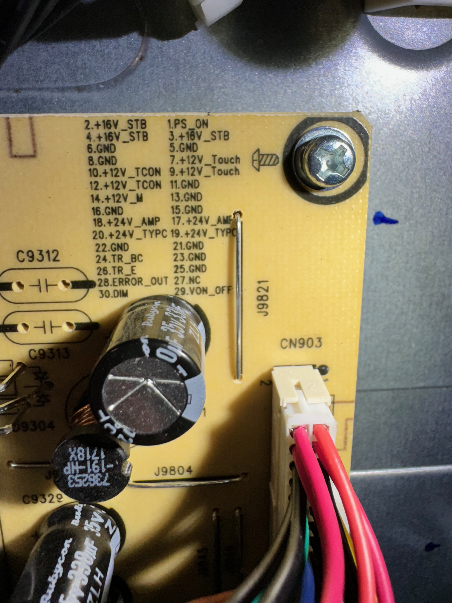

# Main Power Input Header from the PSU to the Carrier

## Labeled as "B" in the photo on the components breakdown.

Pin 1 is the top leftmost pin in the connector

1.) PS_ON

2.) +16V_STB

3.) +16V_STB

4.) +16V_STB

5.) GND

6.) GND

7.) +12V_TOUCH

8.) GND

9.) +12V_TOUCH

10.) +12V_TCON

11.) GND

12.) +12V_TCON

13.) GND

14.) +12V_M

15.) GND

16.) GND

17.) +24V_AMP

18.) +24V_AMP

19.) _24V_TYPC

20.) +20V_TYPC

21.) GND

22.) GND

23.) GND

24.) TR_BC

25.) GND

26.) TR_E

27.) NC

28.) ERROR_OUT

29.) VON_OFF

30.) DIM

31.) NC (Traces to GND)

32.) NC (Traces to GND)
